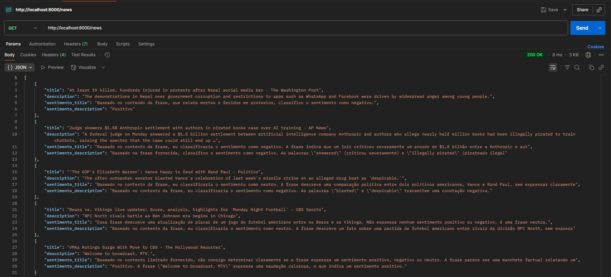

# 📰 News Sentiment Analyzer com AWS Bedrock

Este projeto demonstra como construir uma **pipeline completa de ETL e IA**, integrando coleta de dados de notícias, análise de sentimento usando **AWS Bedrock** e entrega via **API FastAPI**.

---

## 📂 Estrutura do Projeto

```
news-analyzer/
│── app.py # API FastAPI
│── collect.py # Script para coletar notícias (NewsAPI)
│── predict.py # Análise de sentimento usando AWS Bedrock
│── requirements.txt # Dependências
│── data/
│ └── noticias.csv # Notícias coletadas
│ └── noticias_com_sentimento.csv # Resultado da análise
│── README.md
```

---

## 🧩 Funcionalidades

1. **Coleta de notícias**  
   - Usa a API pública do [NewsAPI](https://newsapi.org/) para coletar notícias dos EUA.  
   - Salva em CSV (`data/noticias.csv`) com campos `title`, `description`, `publishedAt`, `source`.

2. **Análise de Sentimento com AWS Bedrock**  
   - Cada notícia é classificada como `positivo`, `negativo` ou `neutro`.  
   - Analisa tanto o **título** quanto a **descrição**.  
   - Usa **retry automático** e **delay** para evitar limite de requisições (Throttling).

3. **API FastAPI**  
   - Roda um endpoint `/news` que retorna as últimas notícias com **sentimento já analisado**.  
   - Exemplo de resposta:

```json
[
  {
    "title": "US markets close higher on tech rally",
    "description": "Tech stocks pushed indexes higher...",
    "sentimento_title": "positivo, pois ...",
    "sentimento_description": "positivo"
  }
]
```

## 🚀 Como rodar o projeto

### Clone o repositório

```bash
git clone https://github.com/seu-usuario/news-analyzer.git
cd news-analyzer
```
### Ative o ambiente virtual

```bash
    venv\Scripts\activate(windows)
    source venv/bin/activate(linux)
```

### Instale dependências

```bash
pip install -r requirements.txt
```

### Configure suas credenciais AWS e sua API Key da newsAPI

```bash
aws configure
```

Necessário para usar o AWS Bedrock.

### Coletar notícias

```bash
python collect.py
```

### Analisar sentimentos

```bash
python predict.py
```

### Rodar API FastAPI

```bash
uvicorn app:app --reload
```

Teste no navegador ou Postman:

`http://127.0.0.1:8000/news`

---

## 🛠 Tecnologias utilizadas

- Python 
- FastAPI → API REST
- Pandas → ETL e manipulação de dados
- AWS Bedrock → LLM gerenciado para análise de sentimento
- Boto3 → SDK AWS para Python
- NewsAPI → Fonte pública de notícias

---

## 🎯 O que este projeto demonstra

- Pipeline completa de ETL → IA → API
- Integração com LLMs em nuvem (AWS Bedrock)
- Boas práticas de MLOps: retry, delay, CSV final com métricas
- Facilidade de apresentação como portfólio para entrevistas de AI Engineering

---

## 📌 Observações

- Para não estourar limites de requisições no Bedrock, o script processa notícias com delay de 1.5s entre chamadas.
- Você pode aumentar a quantidade de notícias, mas em apresentações, 10-20 exemplos já são suficientes.

---

## 📸 Exemplo de Requisição da API\




